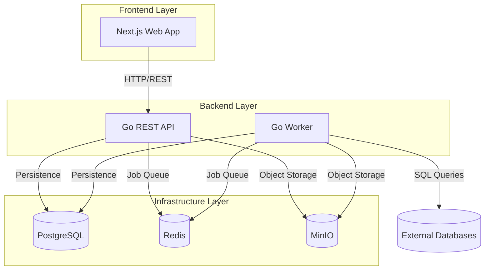
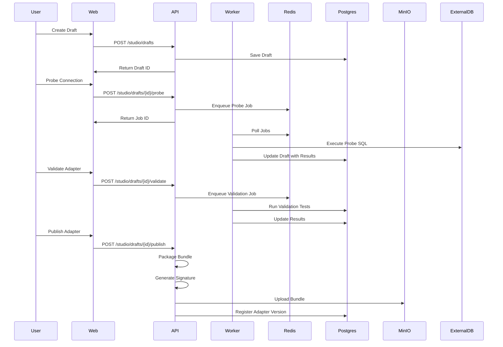
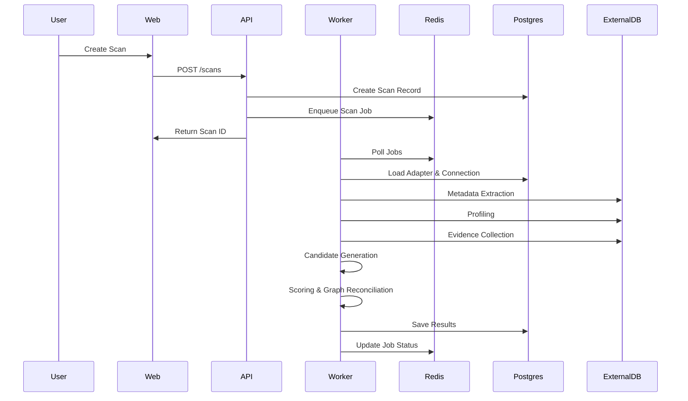

# Architecture Documentation

## System Overview

PK-FK Discovery is an enterprise-grade monorepo application for managing database adapters, running PK/FK discovery scans, and administering the adapter registry.

## Architecture Diagram



## Component Architecture

### Backend (Go)

#### Clean Architecture Layers

```
apps/api/
├── cmd/api/main.go              # Application entry point
├── internal/
│   ├── transport/http/          # HTTP handlers, routing, middleware
│   ├── domain/                  # Business entities and interfaces
│   ├── services/                # Business logic and use cases
│   ├── repositories/            # Data access layer (Postgres)
│   └── integrations/            # External services (Redis, MinIO)
│       ├── redis/
│       └── minio/
```

#### Key Components

- **Transport Layer**: Chi router, REST handlers, middleware (auth, CORS, logging)
- **Domain Layer**: Core entities (User, Adapter, Connection, Scan, Job, AuditLog)
- **Service Layer**: Business logic orchestration
- **Repository Layer**: Postgres implementations
- **Integration Layer**: Redis (job queue, caching), MinIO (object storage)

### Frontend (Next.js)

#### Structure

```
apps/web/
├── app/                         # Next.js App Router pages
├── components/                  # React components
│   ├── ui/                      # shadcn/ui components
│   └── layout/                  # Layout components
├── lib/                         # Utilities and API client
└── hooks/                       # React hooks
```

## Data Flow

### Adapter Creation Flow



### Scan Execution Flow



## Security Architecture

### Authentication & Authorization

- **JWT-based authentication** with refresh tokens
- **RBAC**: Admin, Editor, Viewer roles enforced server-side
- **Future-proof**: Interfaces for SSO/LDAP integration

### Data Protection

- **Secrets encryption**: AES-256-GCM at rest (connections, AI API keys)
- **SQL safety**: Worker enforces SELECT/EXPLAIN only, keyword denylist
- **Audit logging**: All sensitive actions logged with user, IP, timestamp

## Deployment Architecture

### Docker Compose Services

- **web**: Next.js frontend (port 3000)
- **api**: Go REST API (port 8080)
- **worker**: Go worker (no exposed port)
- **postgres**: PostgreSQL (port 5432)
- **redis**: Redis (port 6379)
- **minio**: MinIO object storage (ports 9000, 9001)

### Port Allocation

Intelligent port allocator (`tools/port-allocator`) detects free ports and generates override files automatically.

## Observability

### Logging

- **Structured JSON logs** (logrus/zap)
- **Request IDs** for tracing
- **Audit logs** for compliance

### Health Checks

- `/healthz`: Liveness probe
- `/readyz`: Readiness probe (checks DB/Redis/MinIO)
- `/metrics`: Prometheus metrics

## Scalability Considerations

- **Horizontal scaling**: Stateless API, multiple workers
- **Job queue**: Redis-based with concurrency limits
- **Caching**: Redis for frequently accessed data
- **Object storage**: MinIO for large artifacts

